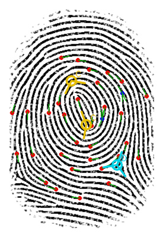

# Fingerprint Feature Extraction Lab - Reverse-Engineered Vision Pipeline

A GitHub-ready reconstruction of an exploratory fingerprint notebook into an ordered classical-computer-vision pipeline for:

- foreground segmentation and ridge enhancement;
- structure-tensor orientation and coherence;
- ridge binarization and one-pixel skeletonization;
- ridge-ending and bifurcation candidates using crossing number;
- skeleton-derived branch directions and conservative quality gates;
- core/delta candidates using a Poincare-index field plus local refinement;
- reproducible PNG, CSV, JSON, notebook, and paper artifacts.



<p align="center">
  <a href="./paper/Fingerprint_Feature_Extraction_Reverse_Engineering_v1_0_0.pdf">
    
  </a>
</p>

## Scientific status

This release is a **single-image research reconstruction**. It is not a production AFIS extractor, not a benchmarked matcher, and not an ISO/IEC 19794-2 encoder. The strict run on `images/input/1.jpg` returns 33 accepted minutia candidates (31 endings and 2 bifurcations), two core candidates, and one delta candidate. These counts are regression outputs, not accuracy claims: no expert ground truth was supplied.

The original notebook's ISO/FMR writer is preserved only in `legacy/` and explicitly quarantined. Its binary round-trip parser is not an independent conformance test, and the cleaned pipeline does not emit an `.fpt` file.

## Repository map

```text
paper/       LaTeX source, bibliography, and compiled paper
notebooks/   cleaned and executed notebook
src/         ordered reusable implementation and experiment runner
results/     images, CSV tables, and JSON diagnostics
images/      input and selected historical output images
legacy/      original unordered notebook and its 208-page PDF rendering
docs/        all-cell audit, execution order, and source walkthrough
tests/       smoke/regression tests
```

## Quick start

```bash
python -m venv .venv
# Windows: .venv\Scripts\activate
# Linux/macOS: source .venv/bin/activate
pip install -r requirements.txt
python src/run_experiment.py
pytest -q
jupyter lab notebooks/fingerprint_feature_extraction_reconstructed.ipynb
```

Run from the repository root. Results are written to `results/`.

## Canonical order

1. load grayscale image;
2. normalize and apply CLAHE;
3. estimate foreground ROI and eroded interior;
4. estimate ridge orientation and coherence through a structure tensor;
5. Otsu-binarize ridges inside the ROI;
6. skeletonize and conservatively prune short spurs;
7. find crossing-number candidates;
8. cluster multi-pixel junctions and trace physical branch arms;
9. apply ROI, coherence, branch-count, branch-length, separation, and broken-ridge filters;
10. detect and refine Poincare core/delta candidates;
11. export auditable figures and tables.

See [`docs/block_execution_order.md`](docs/block_execution_order.md) and [`docs/source_code_walkthrough.md`](docs/source_code_walkthrough.md).

## Main outputs

- `results/figure_pipeline_overview.png`
- `results/figure_minutiae_diagnostics.png`
- `results/figure_singularity_diagnostics.png`
- `results/figure_legacy_vs_reconstructed.png`
- `results/minutiae.csv`
- `results/singular_points.csv`
- `results/diagnostics.json`

## Known limitations

- The ROI heuristic assumes the supplied white-background image.
- One image is insufficient for threshold selection, robustness, or accuracy evaluation.
- Crossing number is highly sensitive to broken ridges and skeleton artifacts.
- Core/delta locations remain sensitive to block size, field smoothing, crop, and Poincare-loop radius.
- Core/delta branch rays are experimental visualization cues, not validated semantic directions.
- A second delta may lie outside the visible/cropped region or be lost by the local field; no class-level conclusion is drawn.

## Release

Version `1.0.0`: archival reverse engineering, ordered pipeline, executed notebook, cell-by-cell audit, figures, tests, and arXiv-style paper.
